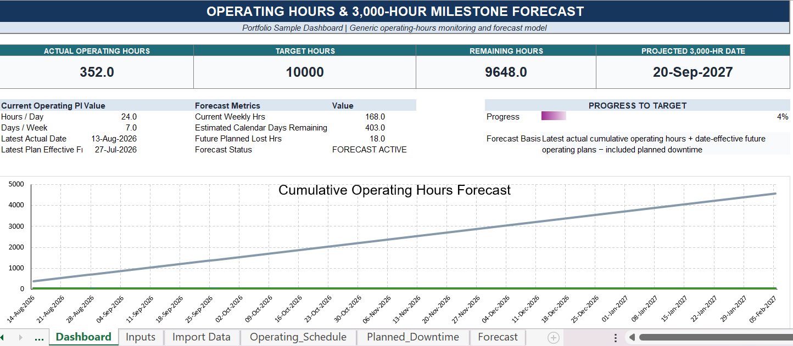
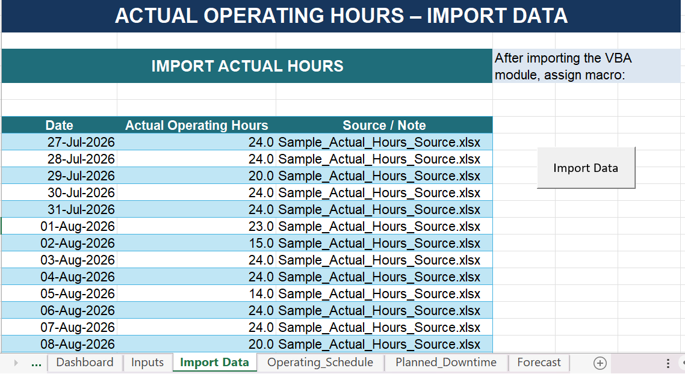
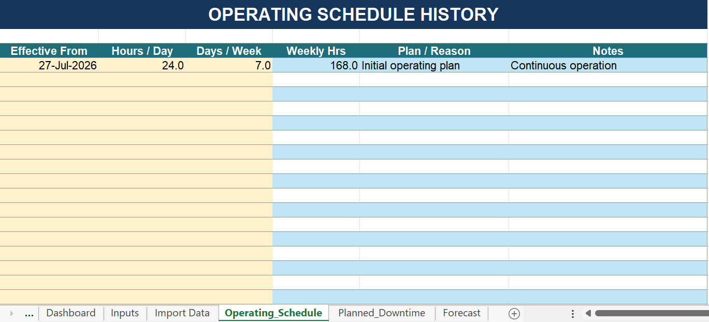

# Operating Hours & 10,000-Hour Forecast Dashboard

An Excel-based monitoring and forecasting tool developed to track equipment operating hours and estimate when a required 10,000-hour operating milestone will be reached.

The project combines Excel, VBA automation, configurable operating schedules, planned downtime, and date-based forecasting into a practical monitoring and reporting tool.

> The complete working workbook, VBA source code, formulas, and calculation logic are intentionally not included in this public repository. This repository is presented as a portfolio case study.

---

## Project Overview

Operational milestone forecasting involves more than simply adding accumulated operating hours.

The expected completion date can change when:

- daily operating hours change;
- the number of operating days per week changes;
- planned shutdowns occur;
- maintenance periods are introduced; or
- new actual operating data becomes available.

This tool was developed to account for these changing conditions while preserving historical operating schedules and automatically recalculating the forecast.

---

## Dashboard



The dashboard presents the operating-hour forecast through a consolidated milestone-planning view.

Key information includes:

- cumulative actual operating hours;
- remaining hours to the 10,000-hour target;
- percentage progress toward the target;
- current weekly operating capacity;
- planned lost operating hours;
- projected 10,000-hour milestone date;
- forecast trajectory against the target;
- current operating plan;
- downtime impact; and
- milestone outlook.

The dashboard is designed to provide both a high-level progress summary and visibility into the operating assumptions affecting the forecast.

The projected milestone automatically recalculates when actual operating data, operating schedules, or planned downtime are updated.

---

## Workflow

```text
Actual Operating Data
        ↓
Data Import
        ↓
Cumulative Operating Hours
        ↓
Remaining Hours to 10,000
        ↓
Operating Schedule
        +
Planned Downtime
        ↓
Daily Forecast Calculation
        ↓
Estimated 10,000-Hour Date
        ↓
Dashboard
```

---

## Data Import Workflow



Actual operating-hour records can be imported from an external Excel source file using a VBA-assisted import workflow.

This reduces repetitive manual entry and allows the monitoring tool to be updated as new operating data becomes available.

The imported records are used to determine the latest actual operating date and calculate the cumulative operating hours achieved to date.

---

## Date-Effective Operating Schedule



The tool supports changes in operating conditions over time.

Each schedule entry can define:

- effective date;
- operating hours per day; and
- operating days per week.

A new operating schedule applies only from its effective date forward.

Previously completed periods retain the operating conditions that were applicable at that time. This prevents future schedule changes from altering historical calculations.

For example, the forecast can accommodate a transition from continuous operation to a reduced operating schedule without changing previously completed operating periods.

---

## Planned Downtime

Planned shutdowns and maintenance periods can be entered separately from the normal operating schedule.

During these periods, forecast operating hours are adjusted accordingly.

This allows the projected 10,000-hour milestone date to account for known future interruptions rather than assuming uninterrupted operation.

The dashboard also summarizes the impact of planned lost operating hours on the current forecast.

---

## Forecasting Logic

The forecasting model combines:

1. cumulative actual operating hours;
2. remaining hours required to reach 10,000 hours;
3. date-effective operating schedules;
4. operating hours per day;
5. operating days per week;
6. planned downtime periods; and
7. daily forecasted operating hours.

The model evaluates future operating dates until the remaining required operating hours reach zero.

The corresponding date becomes the estimated 10,000-hour milestone completion date displayed on the dashboard.

A forecast trajectory provides a visual comparison between projected cumulative operating hours and the 10,000-hour target.

Exact formulas, VBA procedures, and detailed calculation logic are intentionally excluded from the public repository.

---

## Key Features

- Cumulative actual operating-hour tracking
- Automatic identification of the latest actual date
- 10,000-hour milestone monitoring
- Percentage progress tracking
- Automatic remaining-hours calculation
- Forecast trajectory visualization
- Current operating-capacity monitoring
- Date-effective operating schedule changes
- Variable operating hours per day
- Variable operating days per week
- Planned shutdown and maintenance handling
- Planned lost-hours monitoring
- Dynamic milestone-date forecasting
- VBA-assisted data import
- Dashboard-based reporting
- User guidance within the workbook

---

## Workbook Structure

The complete working version contains dedicated worksheets for different parts of the workflow:

| Worksheet | Purpose |
|---|---|
| How to Use | User instructions and workflow guidance |
| Dashboard | Main monitoring and milestone forecast view |
| Inputs | Core calculation inputs and current operating status |
| Import Data | Imported actual operating-hour records |
| Operating Schedule | Date-effective operating schedule configuration |
| Planned Downtime | Planned shutdown and maintenance periods |
| Forecast | Daily forecast calculation engine |

The complete macro-enabled workbook is maintained privately and can be demonstrated when appropriate.

---

## Tools & Technologies

- Microsoft Excel
- VBA
- Excel formulas
- Data validation
- Conditional formatting
- Date-based forecasting
- Automated Excel data import
- Dashboard design

---

## Portfolio Repository

This public repository contains documentation and selected screenshots of the completed project.

To protect the complete implementation, the following are intentionally not publicly distributed:

- macro-enabled working workbook (`.xlsm`);
- VBA source code;
- detailed formulas;
- forecast calculation engine; and
- source data files.

The repository is intended to demonstrate the project's functionality, design, workflow, and technical approach without distributing the complete reusable solution.

---

## Data Privacy

All screenshots and examples presented in this portfolio project use synthetic demonstration data.

No confidential company, client, project, or operational information is included.

---

## Author

Regina Grace

Mechanical Engineering • Project Controls • Data & Automation

---

© 2026 Regina Grace. All rights reserved.

This project is provided for portfolio demonstration and professional evaluation purposes. Reuse, redistribution, or commercial use of the project materials is not permitted without permission.